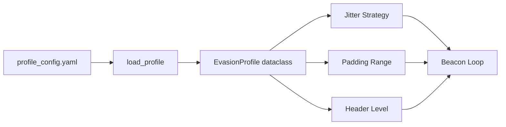

## Overview

Traffic profiles provide a **unified configuration system** that combines jitter strategies, padding ranges, and header randomization levels into named presets. This allows operators to select appropriate evasion levels without manually tuning individual parameters.

## Profile System Architecture

The profile system consists of:

1. **YAML Configuration**: `evasion/profile_config.yaml` defines all profiles
2. **Profile Loader**: `transport/traffic_profile.py` parses and validates profiles
3. **Dataclass**: `EvasionProfile` encapsulates all evasion parameters
4. **Cache**: In-memory cache prevents repeated file reads



## Profile Configuration File

Profiles are defined in `evasion/profile_config.yaml`:

```yaml
# Specify which profile to use by default
active_profile: medium

profiles:
  baseline:
    jitter_pct:   0        # No timing variance
    strategy:     uniform
    padding_min:  0        # No padding
    padding_max:  0
    header_level: 0        # Fixed headers

  low:
    jitter_pct:   10       # ±10% timing variance
    strategy:     uniform
    padding_min:  0
    padding_max:  64       # Up to 64 bytes padding
    header_level: 1        # User-Agent rotation

  medium:
    jitter_pct:   20       # ±20% timing variance
    strategy:     uniform
    padding_min:  0
    padding_max:  128      # Up to 128 bytes padding
    header_level: 2        # UA + Accept-Language rotation

  high:
    jitter_pct:   40       # ±40% timing variance
    strategy:     gaussian # Natural bell-curve distribution
    padding_min:  64       # Minimum 64 bytes padding
    padding_max:  256      # Up to 256 bytes padding
    header_level: 3        # Full header randomization + shuffling
```

### Configuration Fields

<ParamField path="jitter_pct" type="int" required>
  Beacon interval variance as percentage of base interval (0 = no jitter)
  
  **Valid range**: 0-100 (higher = more variance)
</ParamField>

<ParamField path="strategy" type="string" required>
  Jitter distribution algorithm
  
  **Valid values**: `uniform`, `gaussian`
</ParamField>

<ParamField path="padding_min" type="int" required>
  Minimum random padding bytes appended to each beacon payload
  
  **Valid range**: 0-65535 (must be ≤ padding_max)
</ParamField>

<ParamField path="padding_max" type="int" required>
  Maximum random padding bytes appended to each beacon payload
  
  **Valid range**: 0-65535 (must be ≥ padding_min)
</ParamField>

<ParamField path="header_level" type="int" required>
  HTTP header randomization level
  
  **Valid values**: 0 (none), 1 (UA only), 2 (+Accept), 3 (full set)
</ParamField>

## EvasionProfile Dataclass

Profiles are loaded into a typed dataclass:

```python
# Source: transport/traffic_profile.py:17-24
@dataclass
class EvasionProfile:
    name:             str   # Profile name (e.g., "medium")
    jitter_pct:       int   # Jitter percentage
    jitter_strategy:  str   # "uniform" or "gaussian"
    padding_min:      int   # Minimum padding bytes
    padding_max:      int   # Maximum padding bytes
    header_level:     int   # Header randomization level (0-3)
```

**Benefits**:
- Type safety and IDE autocomplete
- Validation at load time
- Immutable configuration (frozen dataclass)
- Clear field documentation

## Loading Profiles

The framework provides two loading functions:

### load_profile(name: str)

Load a specific profile by name:

```python
# Source: transport/traffic_profile.py:72-99
from transport.traffic_profile import load_profile

# Load specific profile
profile = load_profile('high')

print(f"Profile: {profile.name}")
print(f"Jitter: {profile.jitter_pct}% ({profile.jitter_strategy})")
print(f"Padding: {profile.padding_min}-{profile.padding_max} bytes")
print(f"Header level: {profile.header_level}")

# Output:
# Profile: high
# Jitter: 40% (gaussian)
# Padding: 64-256 bytes
# Header level: 3
```

**Error Handling**:
```python
try:
    profile = load_profile('nonexistent')
except ValueError as e:
    print(e)
    # profile "nonexistent" not found in profile_config.yaml.
    # Available profiles: ['baseline', 'low', 'medium', 'high']
```

### load_active_profile()

Load whichever profile is set as `active_profile` in the YAML:

```python
# Source: transport/traffic_profile.py:102-110
from transport.traffic_profile import load_active_profile

# Load the active profile (medium by default)
profile = load_active_profile()

print(f"Using active profile: {profile.name}")
# Output: Using active profile: medium
```

<Info>
  **Recommended**: Use `load_active_profile()` in production code to allow operators to change profiles by editing the YAML without code changes.
</Info>

## Profile Caching

The profile loader implements an in-memory cache:

```python
# Source: transport/traffic_profile.py:12-13
_cache: dict[str, 'EvasionProfile'] = {}  # module-level cache
_raw:   dict = {}                          # cached raw YAML content
```

**Benefits**:
- Avoids repeated file I/O
- Ensures consistent profile across multiple loads
- Negligible memory footprint

```python
# First load reads from disk
p1 = load_profile('medium')

# Second load returns cached object (same object reference)
p2 = load_profile('medium')

assert p1 is p2  # Same object in memory
```

## Profile Validation

The loader validates configuration at load time:

### Strategy Validation

```python
# Source: transport/traffic_profile.py:49-53
if strategy not in VALID_STRATEGIES:
    raise ValueError(
        f"invalid strategy '{strategy}' in profile '{name}'. "
        f"Valid strategies: {VALID_STRATEGIES}"
    )
```

**Valid strategies**: `uniform`, `gaussian`

### Padding Range Validation

```python
# Source: transport/traffic_profile.py:55-59
if padding_min > padding_max:
    raise ValueError(
        f"padding_min ({padding_min}) cannot exceed padding_max ({padding_max}) "
        f"in profile '{name}'"
    )
```

Ensures min ≤ max to prevent runtime errors.

### Missing Active Profile

```python
if not active_name:
    raise ValueError('active_profile field missing from profile_config.yaml')
```

## Built-in Profiles

The framework includes four pre-configured profiles:

<Tabs>
  <Tab title="baseline - No Evasion">
    ```yaml
    baseline:
      jitter_pct:   0
      strategy:     uniform
      padding_min:  0
      padding_max:  0
      header_level: 0
    ```
    
    **Evasion Characteristics**:
    - No timing variance (fixed intervals)
    - No payload padding (2-byte header only)
    - Static headers (fixed Chrome UA)
    
    **Network Overhead**: Minimal (2 bytes per beacon)
    
    **Use Case**: Testing, debugging, controlled environments
    
    **Detection Risk**: ⚠️ High
  </Tab>
  
  <Tab title="low - Light Evasion">
    ```yaml
    low:
      jitter_pct:   10
      strategy:     uniform
      padding_min:  0
      padding_max:  64
      header_level: 1
    ```
    
    **Evasion Characteristics**:
    - ±10% timing variance (uniform distribution)
    - 0-64 bytes random padding per request
    - User-Agent rotation (4 browser options)
    
    **Network Overhead**: ~34 bytes average per beacon
    
    **Use Case**: Low-risk networks, bandwidth-constrained environments
    
    **Detection Risk**: ⚠️ Medium
  </Tab>
  
  <Tab title="medium - Moderate Evasion (Default)">
    ```yaml
    medium:
      jitter_pct:   20
      strategy:     uniform
      padding_min:  0
      padding_max:  128
      header_level: 2
    ```
    
    **Evasion Characteristics**:
    - ±20% timing variance (uniform distribution)
    - 0-128 bytes random padding per request
    - UA + Accept-Language rotation (28 combinations)
    
    **Network Overhead**: ~66 bytes average per beacon
    
    **Use Case**: Standard operations, corporate networks
    
    **Detection Risk**: ⚠️ Low-Medium
    
    <Note>
      **Default Profile**: Medium provides balanced stealth and performance for most scenarios.
    </Note>
  </Tab>
  
  <Tab title="high - Aggressive Evasion">
    ```yaml
    high:
      jitter_pct:   40
      strategy:     gaussian
      padding_min:  64
      padding_max:  256
      header_level: 3
    ```
    
    **Evasion Characteristics**:
    - ±40% timing variance (gaussian bell-curve)
    - 64-256 bytes guaranteed padding per request
    - Full header randomization + order shuffling (252 combinations)
    
    **Network Overhead**: ~162 bytes average per beacon
    
    **Use Case**: High-security environments, advanced threat detection present
    
    **Detection Risk**: ✓ Low
  </Tab>
</Tabs>

## Usage in Beacon Implementation

Typical beacon initialization:

```python
from transport.traffic_profile import load_active_profile
from evasion.sleep_strat import get_sleep_fn
from evasion.padding_strat import pad
from evasion.header_randomizer import get_headers
import time

# Load profile once at startup
profile = load_active_profile()
sleep_fn = get_sleep_fn(profile.jitter_strategy)

BEACON_INTERVAL_S = 30.0

def beacon_loop():
    while True:
        # 1. Prepare beacon message
        message = create_beacon_message()
        
        # 2. Apply padding based on profile
        padded_message = pad(
            message,
            profile.padding_min,
            profile.padding_max
        )
        
        # 3. Generate randomized headers based on profile
        headers = get_headers(profile.header_level)
        
        # 4. Send beacon
        send_beacon(padded_message, headers)
        
        # 5. Sleep with jitter based on profile
        sleep_duration = sleep_fn(BEACON_INTERVAL_S, profile.jitter_pct)
        time.sleep(sleep_duration)
```

## Creating Custom Profiles

Add new profiles by editing `profile_config.yaml`:

```yaml
profiles:
  # ... existing profiles ...
  
  custom_stealth:
    jitter_pct:   30        # Custom jitter level
    strategy:     gaussian  # Use natural bell-curve
    padding_min:  128       # Always at least 128 bytes
    padding_max:  512       # Up to 512 bytes
    header_level: 3         # Maximum header randomization
```

Then load it:

```python
profile = load_profile('custom_stealth')
```

<Warning>
  **Configuration Changes**: Modifications to `profile_config.yaml` require application restart to take effect (due to caching).
</Warning>

## Profile Selection Guidelines

<Steps>
  <Step title="Assess Target Environment">
    Identify security controls present:
    - Basic logging only → `low` or `medium`
    - IDS/IPS deployed → `medium` or `high`
    - Advanced EDR/NDR → `high`
    - Government/military → `high` + custom adjustments
  </Step>
  
  <Step title="Evaluate Bandwidth Constraints">
    Consider network limitations:
    - Unrestricted bandwidth → Use `high` for maximum stealth
    - Limited bandwidth → Use `low` or `medium` to reduce overhead
    - Metered connection → Consider custom profile with lower padding_max
  </Step>
  
  <Step title="Consider Operation Duration">
    Long-term operations require stronger evasion:
    - Short-term (hours) → `medium` acceptable
    - Medium-term (days) → `high` recommended
    - Long-term (weeks+) → `high` + periodic profile rotation
  </Step>
  
  <Step title="Test Profile Performance">
    Validate beacon reliability:
    ```python
    # Test connectivity with selected profile
    profile = load_profile('high')
    
    for i in range(10):
        success = test_beacon(profile)
        print(f"Beacon {i+1}: {'✓' if success else '✗'}")
    ```
  </Step>
</Steps>

## Operational Security

### Profile Consistency

<Warning>
  **Avoid Mid-Operation Profile Changes**: Switching profiles during an active operation may create detectable pattern shifts. Select the appropriate profile before deployment and maintain it throughout.
</Warning>

Example of **detectable** profile change:
```
00:00-02:00  medium profile (20% jitter, 0-128 byte padding)
02:00-04:00  high profile   (40% jitter, 64-256 byte padding)
             ↑ Sudden change in traffic patterns may trigger alerts
```

### Profile Logging

The loader logs profile selection for audit trails:

```python
# Source: transport/traffic_profile.py:90-97
logger.info('profile loaded', extra={
    'profile': name,
    'jitter_pct':      profile.jitter_pct,
    'jitter_strategy': profile.jitter_strategy,
    'padding_min':     profile.padding_min,
    'padding_max':     profile.padding_max,
    'header_level':    profile.header_level,
})
```

**Log Output**:
```json
{
  "timestamp": "2026-03-11T10:23:45Z",
  "level": "INFO",
  "message": "profile loaded",
  "profile": "high",
  "jitter_pct": 40,
  "jitter_strategy": "gaussian",
  "padding_min": 64,
  "padding_max": 256,
  "header_level": 3
}
```

## Performance Impact

### Profile Load Time

```python
import time

start = time.time()
profile = load_profile('high')
elapsed = time.time() - start

print(f"Load time: {elapsed*1000:.2f}ms")
# Output: Load time: 0.23ms (first load)
# Output: Load time: 0.001ms (cached)
```

**First Load**: Approximately 0.2-0.5ms (YAML parsing)
**Cached Load**: Less than 0.01ms (dictionary lookup)

### Runtime Overhead by Profile

| Profile | Jitter CPU | Padding CPU | Header CPU | Network Overhead |
|---------|-----------|-------------|------------|------------------|
| baseline | Negligible | Negligible | Negligible | +2 bytes |
| low | Negligible | Negligible | Negligible | ~+34 bytes |
| medium | Negligible | Negligible | Negligible | ~+66 bytes |
| high | Negligible | Negligible | Negligible | ~+162 bytes |

<Info>
  All evasion operations are **stateless** and use simple algorithms (random number generation, array shuffling). CPU and memory overhead is negligible even at high request rates.
</Info>

## Testing Profiles

### Validate All Profiles Load

```python
from transport.traffic_profile import load_profile

for name in ['baseline', 'low', 'medium', 'high']:
    profile = load_profile(name)
    assert profile.name == name
    assert profile.padding_min <= profile.padding_max
    assert profile.jitter_strategy in ('uniform', 'gaussian')
    assert 0 <= profile.header_level <= 3
    print(f"✓ Profile '{name}' valid")
```

### Verify Active Profile

```python
from transport.traffic_profile import load_active_profile

active = load_active_profile()
print(f"Active profile: {active.name}")
assert active.name == 'medium'  # Default per YAML
```

### Profile Comparison

```python
# Compare evasion strength across profiles
profiles = ['baseline', 'low', 'medium', 'high']

for name in profiles:
    p = load_profile(name)
    
    # Calculate evasion score (arbitrary metric)
    score = (
        p.jitter_pct +                    # Timing variance
        (p.padding_max / 10) +            # Padding strength
        (p.header_level * 10)             # Header diversity
    )
    
    print(f"{name:10} - Evasion Score: {score:.1f}")

# Output:
# baseline   - Evasion Score: 0.0
# low        - Evasion Score: 26.4
# medium     - Evasion Score: 52.8
# high       - Evasion Score: 95.6
```

## Troubleshooting

<AccordionGroup>
  <Accordion title="ValueError: profile not found">
    **Error**:
    ```
    ValueError: profile "production" not found in profile_config.yaml.
    Available profiles: ['baseline', 'low', 'medium', 'high']
    ```
    
    **Cause**: Requested profile name doesn't exist in YAML
    
    **Fix**: Add the profile to `profile_config.yaml` or use an existing profile name
  </Accordion>
  
  <Accordion title="ValueError: invalid strategy">
    **Error**:
    ```
    ValueError: invalid strategy 'random_walk' in profile 'custom'.
    Valid strategies: ('uniform', 'gaussian')
    ```
    
    **Cause**: Profile specifies unsupported jitter strategy
    
    **Fix**: Use `uniform` or `gaussian` in the `strategy` field
  </Accordion>
  
  <Accordion title="ValueError: padding_min > padding_max">
    **Error**:
    ```
    ValueError: padding_min (256) cannot exceed padding_max (128) in profile 'broken'
    ```
    
    **Cause**: Invalid padding range configuration
    
    **Fix**: Ensure `padding_min` ≤ `padding_max` in YAML
  </Accordion>
  
  <Accordion title="FileNotFoundError: profile_config.yaml">
    **Error**:
    ```
    FileNotFoundError: profile_config.yaml not found at /path/to/evasion/profile_config.yaml
    ```
    
    **Cause**: Config file missing or incorrect path
    
    **Fix**: Verify `profile_config.yaml` exists in `evasion/` directory
  </Accordion>
</AccordionGroup>

## Related Topics

<CardGroup cols={3}>
  <Card title="Jitter Strategies" icon="clock" href="/evasion/jitter-strategies">
    Deep dive into jitter_pct and strategy fields
  </Card>
  <Card title="Traffic Padding" icon="shuffle" href="/evasion/traffic-padding">
    Understand padding_min and padding_max
  </Card>
  <Card title="Header Randomization" icon="fingerprint" href="/evasion/header-randomization">
    Learn about header_level options (0-3)
  </Card>
</CardGroup>